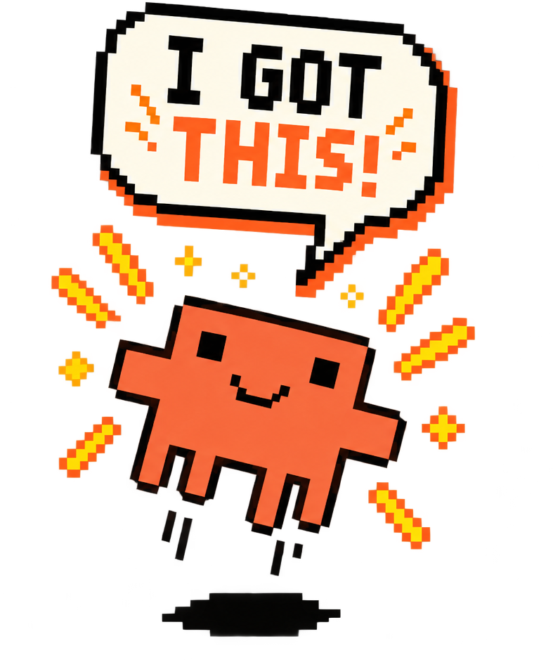

# hype

<table>
<tr>
<td width="25%">

</td>
<td width="75%">

A hype man for Claude Code. Injects a motivational message ("Believe in
yourself!", "You got this!") into every turn via a `UserPromptSubmit` hook —
and into about 10% of `PreToolUse` calls for good measure — so Claude never
forgets to believe in itself. 🥺

Inspired by [this tweet](https://x.com/trq212/status/2086876017319457181?s=20).

Combine with [keepgoing](../keepgoing/) for the ultimate scientific buddy:
one hook that reminds Claude to believe in itself, another that refuses to
ever let it give up.

</td>
</tr>
</table>

## Install

This plugin is Claude Code-only. In Claude Code, run:

```
/plugin marketplace add stbenjam/skills
/plugin install hype@stbenjam
```

## Customization

Set `HYPE_MESSAGES_FILE` to a text file of your own slogans — one per line;
blank lines and `#` comments are ignored. Export it in the shell where you
launch Claude Code, or set it per project in `.claude/settings.json`:

```json
{
  "env": {
    "HYPE_MESSAGES_FILE": "./hype-slogans.txt"
  }
}
```
